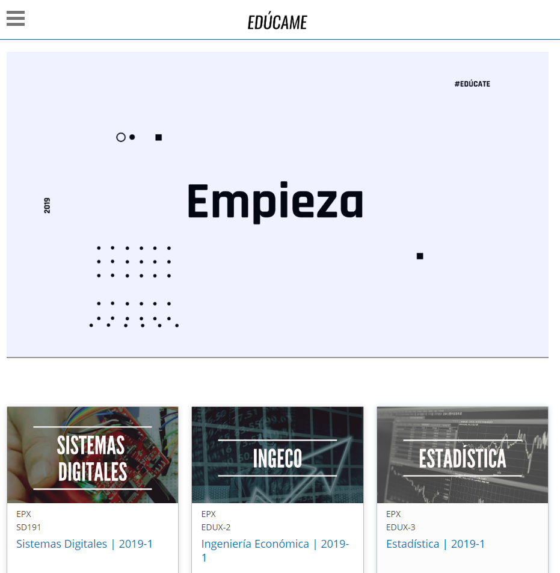

# EducameX

Starter theme for developing comprehensive theme on Open edX

## How to use

1. Ir a la carpeta que tiene el tema

		$ cd apps/edx/edx-platform/

2. Remover la antigua carpeta `/educame/`

		$ sudo rm -r educame

3. Clonar el repositorio de Github actualizado

		$ sudo git clone https://github.com/ZurMaD/educame

4. Compilar los temas

		$ cd apps/edx/bin

5. Make some changes in `lms.env.json` located in `/edx/app/edxapp/`. Then change some variables to this:

		ENABLE_COMPREHENSIVE_THEMING: true,
		COMPREHENSIVE_THEME_DIRS: ["/edx/app/edxapp/themes"],
		DEFAULT_SITE_THEME: "starter-theme",

6. Back to ubuntu sudo users, and restart the edxapp to load new configuration.

		$ exit
		$ sudo /edx/bin/supervisorctl restart edxapp:

7. Run the `update.sh` script. To apply the themes.

		$ cd /edx/app/edxapp/themes/starter-theme/
		$ sh update.sh

